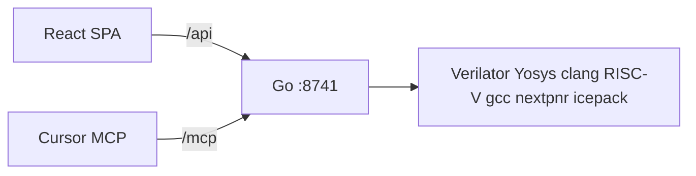

# Tiny GPU Bench — master plan (coding agent)

> Exported from Notion on 17 Aug 2026. **This file is now the source of truth.**
> Original Notion page (`3bfdf6f0-c0bd-8145-b4f0-f503776bf62d`) was removed after this export. No child pages, comments, or other Tiny GPU Bench Notion pages were found.

---

> 📌 This is the **source of truth** for Tiny GPU Bench. A coding agent (Composer or similar) should **implement the whole page**, then **test in a browser**, **fix bugs**, and **write the docs**. Do **not** put this app inside [omnaidu.com](http://omnaidu.com). Do **not** add `/lab` on the personal site.

> 🔄 **17 Aug 2026 — Om.** No desktop / Tauri. **Browser SPA + one Docker server (Go).** Same process is the **MCP server, no password**, host publish **127.0.0.1 only**. UI = polished **dark** lab. Docs must be good enough to write a blog from.

> ⚠️ **Can one coding agent finish this?** Most of it **yes** (SPA, Go API, Docker, MCP, docs, browser QA). The **hard** bit is first green Verilator + PicoRV32 + RISC-V C + DPI dumps. If you stall there, do **not** fake PASS. Write `docs/gaps.md` and keep going on UI/docs.

## Why we are doing this

Om is a full-stack / AI engineer, new to chips. College memory: Verilog editor → compile → USB to an FPGA board. The goal is a **friendly lab in the browser** so students (and an AI) can write Verilog + C, press Run, and **see** if it is true: 8 LEDs, 4 drawn motors, a tiny GPU screen, text, waves, PASS/FAIL.

We are **not** printing iPhones and **not** replacing Cadence. We are the **open write-and-test lab** for a **tiny** digital machine. Later Om writes a `projects` post on [omnaidu.com](http://omnaidu.com) with a short clip. The site stays a writing index. **This repo’s `docs/` is the raw material for that post.**

## What we are building (simple)

**Tiny GPU Bench** = **one Docker box** + **one SPA in the browser**.

- `docker compose up --build` → open `http://127.0.0.1:8741`
- **Go server** in Docker starts Verilator / Yosys / RISC-V gcc / nextpnr-ice40
- **React SPA** is only the bench (no chip tools in the tab)
- **MCP** on the **same** Go server: `http://127.0.0.1:8741/mcp` — **no auth**, no TLS, no headers
- Verilog describes the machine. C runs on the CPU **inside** that machine. They meet on addresses.
- Simulate on the server. **Export FPGA** = `.bin` for iCE40 hx8k. No USB.

**GPU here** = paints pixels when C asks. Not CUDA. Not NVIDIA. C does **not** run on the GPU.

**Not** a compiler we write. We **call** Verilator, Yosys, gcc, nextpnr.

## What we are NOT implementing

- Tauri, Electron, Wails, .dmg / .AppImage / .exe
- Hono / Node as the API server (Go is the server)
- Synopsys / Cadence / Siemens, TSMC PDKs, 3 nm, iPhone, NVIDIA GPU
- Cloudflare Workers or Vercel Functions as the simulator
- Browser-only Wasm Verilator
- Rewriting Verilator / Yosys / clang; Verilator FFI
- Analog, OpenROAD, extra CPU instructions, real motors/USB
- Light mode, `/lab` on [omnaidu.com](http://omnaidu.com)
- Publishing `0.0.0.0:8741` on the host. **No MCP password** ⇒ localhost only
- Full OSS CAD Suite zip. Only the apt programs listed below
- Extra templates, chatbot in the drawer

## Conversation summary (decisions only)

1. Verilog = machine. C = program on a CPU block. True sandwich only if a CPU is in the design.
2. Simulate ≠ FPGA ≠ factory. Simulate is still useful.
3. Open tools = lab. Paid shops = factory stamp.
4. 8 LEDs, 4 **drawn** servos. Real motors = college board + `.bin` later.
5. UI = bench, not Cursor. SPA, polished dark, motion.
6. **Client-server + Docker.** No desktop shell.
7. **Go** server (not Node/Hono, not required Rust). MCP unauthenticated on localhost.
8. New GitHub repo. Blog later from `docs/`.
9. [omnaidu.com](http://omnaidu.com) messy lab code was deleted. Plan lives here.

## Decision log (write this into `docs/04-decisions.md` — blog fuel)

Agents must copy this timeline and add dates/PRs as they implement.

1. **Lab not factory** — open Verilator/Yosys, not Cadence.
2. **Tiny GPU = painter**, not NVIDIA.
3. **First shape was Tauri desktop** — dropped 17 Aug 2026; install was too fat; waiters in Rust were only because of Tauri.
4. **Client-server + Docker** — student needs Docker + browser. Kitchen stays in the image.
5. **Not Workers / Vercel Functions** — they cannot hold Verilator+clang.
6. **Not full OSS CAD Suite** — only Verilator, clang, Yosys, nextpnr-ice40, icepack, RISC-V gcc.
7. **Node/Hono was drafted** as one-language convenience — **replaced by Go** (Om, 17 Aug 2026): spawn/timeout/kill children is the waiter’s job; Go is honest for that; still easier to ship than Rust now that Tauri is gone.
8. **MCP no password** — safe only because compose publishes **127.0.0.1**. Origin check still required.
9. **SPA (Vite + React)** — one page lab, not Next.js SSR. Go serves `apps/web/dist`.
10. **PASS is numbers**, not vibes (`expected.json`).

## What YOU (Om) must do

- [ ] Empty GitHub repo `tiny-gpu-bench`. Send URL to the coding agent.
- [ ] Docker Desktop (or Engine).
- [ ] Do not merge into [omnaidu.com](http://omnaidu.com) / `/lab`.
- [ ] After `compose up`: open UI; paste MCP URL; no headers.
- [ ] Blog from `docs/` + 30–60s clip. No video on `/`.
- [ ] Never publish 8741 to the public internet.

## Locked technical decisions

| Topic | Decision |
| --- | --- |
| Shape | Browser **SPA** client + **one** Docker service. No Tauri |
| Frontend | React 19 + **Vite** (SPA) + Tailwind v4 + shadcn/ui + Geist + Monaco + motion. Dark only `#14120b` / `#efece6` / `#ff6a2a` |
| Backend | **Go 1.23+**, std `net/http`, one binary `tiny-gpu-bench`. Module path `tiny-gpu-bench`. Official MCP: `github.com/modelcontextprotocol/go-sdk` Streamable HTTP on `/mcp` |
| Why Go | Start/kill Verilator with timeouts; one static-ish binary in Docker; MCP SDK exists. Not because Go is “more chip.” Rust is also good; Om chose Go |
| Simulate | Verilator. Icarus not in image |
| Compilers in image | Host **clang** · **lld**. Firmware: `riscv64-unknown-elf-gcc -march=rv32i -mabi=ilp32` |
| How big? | Yosys `stat` |
| FPGA | yosys `synth_ice40` → nextpnr-ice40 `--hx8k` → icepack → `.bin` only |
| CPU / GPU / IO | PicoRV32. GPU 64×64, 8-bit **RGB332**, 4 pixel lanes/cycle. 8 LEDs, 1 button, 4 PWM, UART log |
| Template | Only `hello-gpu` |
| HTTP | Port **8741**. SPA `/`. API `/api/`. MCP `/mcp`. No auth. No TLS |
| Docker | `127.0.0.1:8741:8741`, mem **4g**, cpus **2**, sim timeout **120s** |
| License | Our code Apache-2.0. Verilator LGPL = separate binaries in the image |

## Possible vs not possible

**Possible:** class Verilog+C on this SoC; PASS; lamps; drawn motors; tiny picture; gate count; one template; `.bin` export; MCP; Docker.

**Not possible:** Cadence/TSMC/NVIDIA; analog; USB; public no-password MCP; desktop installer.

## Concepts

| Word | Meaning |
| --- | --- |
| SPA | One web app in the browser. No full page reload for Run |
| Client | The SPA |
| Server | The Go process in Docker |
| Simulate | Play the machine on the server. No board |
| MCP | How Cursor calls the same Run/read tools |

## Architecture



**One container.** Go spawns tools. React never shells to Verilator. MCP handlers **must** call the same Go functions as `/api`.

**Sim process:** long-running `build/sim` with **stdin commands** (JSON lines) and **stdout snapshots** (JSON lines). Commands: `reset`, `run <n>`, `step`, `quit`, `set_btn <0|1>`. Default **Run** = `reset` then `run` up to **2_000_000** cycles or until firmware writes a halt (see HDL). **Step** = `step` (one clock). If live step is too hard, write `docs/gaps.md` — do **not** lie in the UI.

One job at a time. Second Run → HTTP 409. Timeout → kill process group.

## UI vision (Composer: this is the look — raise it, don’t shrink it)

**Feel:** a dark **instrument panel** in a chip lab at night. Quiet luxury, not a purple AI dashboard, not shadcn-on-gray, not a VS Code clone.

**Color:** void `#14120b`, cream `#efece6`, ember `#ff6a2a`. Borders cream at 8–12% opacity. Ember only on Run, PASS glow, lit LEDs, active block. No rainbow, no light mode, no theme switch.

**Type:** Geist. Tabular nums for cycles. Small labels in cream/60%. Title: “Tiny GPU Bench”.

**SPA:** Vite. One shell. Monaco in the center. No Next.js. No extra routes except `/` (and static `/docs` files if linked).

**Layout (fixed, desktop-first, min width ~1280):**

- **Top bar** 48px: wordmark, cycle count, PASS/FAIL pill, Run (ember), Step, Reset, How big?, Export FPGA. Buttons with tooltips.
- **Left rail** ~200px: blocks CPU RAM GPU UART GPIO PWM as cards. Selected = ember hairline.
- **Center:** Monaco, current file, dark theme matching void (not stock vs-dark if it clashes).
- **Right rail** ~280px: 64×64 **integer scale** (×8 or ×10), nearest-neighbor, ember bezel, inner shadow (tiny CRT). 8 round LEDs with **glow**. 4 servo arms, 200ms rotate, duty 0–255 → 0–180°. Caption: “Drawn motors — not real.”
- **Bottom** ~180px: canvas waves (`clk`, `gpu_busy`, `led[0]`, `pwm0`) + UART log (mono, cream).
- **Drawer (Sheet):** last MCP tool + PASS/FAIL. **Not a chat.**

**Motion:** 150–250ms. `prefers-reduced-motion: reduce` = instant.

**States:** skeleton on first load; Run = disable Run + “Running the fake chip…”; errors = slide-over with full log + Copy; empty = “Press Run. You should see hello and a rectangle.” First-visit 3 steps (fake chip / C is the brain / GPU is the screen), never blocks Run.

**Polish bar:** if it looks like a default shadcn template, it **fails**. Spacing 8px grid. No layout jump when PASS appears.

shadcn: Button, Tabs, Tooltip, Dialog, Sheet, Badge, Alert, ScrollArea, Separator, Toggle, Slider.

## Hardware contracts (do not invent a second map)

**Addresses:** RAM `0x0000_0000`, LEDs `0x1000_0000` (bits 0–7), BTN `0x1000_0004` (read, UI drives it), UART TX `0x2000_0000`, UART status `0x2000_0004` bit0 tx ready, PWM0–3 `0x3000_0000 + 4*n` duty 0–255, GPU CMD `0x4000_0000`, GPU STAT `0x4000_0004` bit0 busy.

**GPU CMD word** (one write, little-endian):

- `[31:28]` op: `1` CLEAR (fill with color `[7:0]`), `2` SET_COLOR (color `[7:0]`), `3` PUT_PIXEL (`[13:8]`=x, `[5:0]`=y, pixel uses current color), `4` FILL_RECT (`[27:22]`=x, `[21:16]`=y, `[13:8]`=w, `[5:0]`=h, current color). Coords 0–63.
- Busy: C must poll STAT bit0 = 0 before the next CMD. CLEAR/FILL may take many cycles (4 pixels/cycle).

**Color:** RGB332 in the 8-bit pixel (`RRRGGGBB`). `fb.bin` = 4096 bytes, row-major, y=0 top.

**Dumps** (DPI or C++ harness, same names):

- `uart.log` UTF-8 text
- `leds.json` `{"leds":0-255}`
- `pwm.json` `{"duty":[a,b,c,d]}`
- `fb.bin` 4096 bytes
- `waves.json` last ≤1024 samples: `{ "clk":[], "gpu_busy":[], "led0":[], "pwm0":[] }` (0/1 or 0–255 for pwm0)

**Firmware:** `firmware/link.ld` at `0x00000000`, PicoRV32 reset, `main` in `templates/hello-gpu/main.c`. Bounded loops only. UART `hello from tiny-gpu`, LED chaser, GPU rects + letters **OM**, PWM 32/96/160/224. `firmware/README` lists **exact** gcc flags; `scripts/dev-sim.sh` must use the same.

**HDL files:** `soc.v`, vendor `picorv32.v`, `ram.v`, `gpio_led.v`, `uart_tx.v`, `pwm.v`, `gpu.v`, bus mux, `sim/dpi_dump.cpp` + harness `sim/main.cpp`.

**PASS `templates/hello-gpu/expected.json`:** UART contains `hello from tiny-gpu`; `leds != 0` at end; `fb_sha256` matches committed golden (generate once from a known-good run, commit the hash). Agent must **simulate** before claiming PASS.

## Docker image — only these programs

Base `ubuntu:24.04`. Apt: `verilator`, `clang`, `lld`, `yosys`, `yosys-abc`, `nextpnr-ice40`, `nextpnr-ice40-chipdb`, `fpga-icestorm`, `gcc-riscv64-unknown-elf`, `binutils-riscv64-unknown-elf`, `make`, `python3`, `ca-certificates`.

**Do not:** GHDL, gtkwave, other nextpnr families, cocotb, solvers, openFPGALoader, OSS CAD tarball, Node in the **runtime** image (Node only in the frontend **build** stage).

**Multi-stage:** (1) Node 22 + pnpm build `apps/web` (2) `golang:1.23` build `./cmd/tiny-gpu-bench` (3) runtime = tools + binary + `web/dist` at `/app/web`.

**Compose (lock):**

```yaml
services:
  bench:
    build: .
    ports:
      - "127.0.0.1:8741:8741"
    mem_limit: 4g
    cpus: 2.0
    environment:
      HOST: "0.0.0.0"
      PORT: "8741"
      WEB_ROOT: "/app/web"
      WORKSPACE: "/data/workspace"
      SIM_TIMEOUT_SEC: "120"
    volumes:
      - bench-workspace:/data/workspace
volumes:
  bench-workspace:
```

Go listens `0.0.0.0:8741` **inside** the container. Host publish stays `127.0.0.1`.

## JSON API

CORS: `http://127.0.0.1:8741`, `http://localhost:8741` only. Origin check on MCP too.

| Method | Path | MCP tool |
| --- | --- | --- |
| POST | `/api/simulate` | `simulate` |
| POST | `/api/step` | `step` |
| POST | `/api/reset` | `reset` |
| POST | `/api/button` body `{"down":true}` | optional helper; UI button |
| GET/PUT | `/api/files` and `/api/files/*` | `list_files` `read_file` `write_file` (jail, no `..`) |
| POST | `/api/gate-count` | `gate_count` |
| POST | `/api/export-fpga` | `export_fpga` |
| GET | `/api/uart` `/api/leds` `/api/servos` `/api/waves` `/api/status` | matching get_* |
| GET | `/api/framebuffer` and `/api/framebuffer.png` | `get_framebuffer` |
| POST | `/api/load-template` | `load_template` |
| GET | `/health` | `{ "ok": true }` |

## HTTP MCP (no authentication)

Use **official** [`github.com/modelcontextprotocol/go-sdk`](https://github.com/modelcontextprotocol/go-sdk) `NewStreamableHTTPHandler` on `/mcp`. Protocol **2025-11-25** (Cursor-friendly). No Bearer, no query token.

Cursor:

```json
{
  "mcpServers": {
    "tiny-gpu-bench": {
      "url": "http://127.0.0.1:8741/mcp"
    }
  }
}
```

Tools: `simulate`, `step`, `reset`, `list_files`, `read_file`, `write_file`, `gate_count`, `export_fpga`, `get_uart`, `get_leds`, `get_servos`, `get_framebuffer`, `get_waves`, `get_status`, `load_template`.

`docs/05-mcp.md` must include a **copy-paste curl** initialize + `tools/call` simulate.

## Install / run

Need: Docker + Git.

```bash
git clone <repo>
cd tiny-gpu-bench
docker compose up --build
```

Open [http://127.0.0.1:8741](http://127.0.0.1:8741). First build is slow.

## Repo layout

```text
tiny-gpu-bench/
  Dockerfile  docker-compose.yml  README.md
  cmd/tiny-gpu-bench/     # main
  internal/api/ sim/ mcp/ workspace/
  apps/web/
  hdl/ firmware/ templates/hello-gpu/ sim/ scripts/
  docs/   .cursor/skills/tiny-gpu-bench/
```

## Documentation the agent MUST write (blog source)

Keep language plain. Om will paste into [omnaidu.com](http://omnaidu.com) later.

- `README.md` — what it is (3 short paragraphs), install, Run, MCP snippet, not Cadence
- `docs/00-what.md` — what / what it does / what it is not
- `docs/01-install.md` — Docker, compose, RAM, first-build wait
- `docs/02-use.md` — click Run, edit C, How big?, Export FPGA, Cursor MCP
- `docs/03-how-it-works.md` — SPA → Go → child processes; Verilog vs C; address map
- `docs/04-decisions.md` — the decision log above + why Go, why Docker, why not Workers, why no auth, why SPA, why this GPU
- `docs/05-mcp.md` — unauthenticated localhost, curl, tool list
- `docs/qa-log.md` — **every** bug found in browser/API testing, how it was fixed
- `docs/gaps.md` — anything unfinished, too hard, or that needs a **stronger model** (be specific: file, error, what you tried)

## Implementation order

1. Vite SPA dark chrome (layout + tokens). No fake PASS.
2. Go `net/http`: `/health`, static SPA, `/api/status`.
3. HDL + firmware + harness; `scripts/dev-sim.sh` exit 0 (hello, LED, pixels) **inside Docker**.
4. Go sim runner (spawn, timeout, parse dumps). Tests.
5. Wire Run/Step/Reset/button. PASS via `expected.json`.
6. Yosys How big?
7. FPGA export hx8k; JSON error if missing.
8. MCP `/mcp` all tools, no auth, Origin check, curl in docs.
9. Dockerfile + compose as locked. `/health` green.
10. UI polish (glow, CRT pixels, waves, skeletons, reduced motion, 3-step overlay).
11. **Write all docs listed above.**
12. **Browser QA loop** (below). Fix. Log in `docs/qa-log.md`.
13. Final `docs/gaps.md`.

**Done means:** compose up → browser Run → hello + LEDs + servos + pixels + PASS; MCP `simulate` with no headers; README + `docs/04-decisions.md` exist.

## Browser QA (required — use the agent’s browser)

After compose is healthy, **open** `http://127.0.0.1:8741` and actually click. Do not skip.

Checklist:

1. First paint: dark, no white flash, layout not broken at 1280 and 1440 width.
2. Empty copy visible. 3-step overlay dismisses and stays gone on reload (localStorage).
3. Run → wait → UART has hello, LEDs not all dead, rectangle/OM on screen, PASS green.
4. Break `main.c` (delete a semicolon), Run → FAIL, log panel, Copy works, no `alert`.
5. Fix file, Run → PASS again.
6. Click GPU vs CPU: Monaco file changes.
7. How big? returns numbers, no crash.
8. Export FPGA downloads `.bin` or a clear error.
9. Reduced-motion: still usable.
10. MCP: curl initialize + simulate from docs.
11. Second Run while busy → 409 or disabled button.

Fix every fail. Append to `docs/qa-log.md`. Improve spacing/type/glow if it still looks cheap.

## If you get stuck (stronger model)

Put in `docs/gaps.md`: title, what you tried, exact error, files. Typical danger: PicoRV32 memory interface, firmware not fetching, GPU busy never clearing, Verilator compile flags. **Never** ship `MOCK_SIM=1` as real PASS.

## Agent skill

Locked table + contracts + docs + browser QA. Tests: `dev-sim.sh` and curl `/health` + `/api/simulate`.

## Exa verification (Aug 2026)

- MCP Streamable HTTP; official Go SDK `github.com/modelcontextprotocol/go-sdk`.
- Verilator generates C++ then compiles.
- PicoRV32 + yosys `synth_ice40` + nextpnr-ice40 `--hx8k` + icepack.
- Firmware needs RISC-V gcc.
- Workers/Vercel Functions are not the kitchen.

## This page MUST / MUST NOT

**Must:** Go+Docker+SPA, UI vision, contracts, MCP no auth, docs list, decision log, browser QA, gaps file, Om checklist.

**Must not:** Tauri; steal PDKs; Worker sim; MCP tokens; light mode; publish 0.0.0.0.
