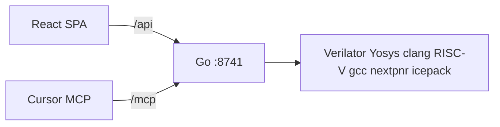

# How it works

## Architecture

One Docker container runs one Go binary. The SPA never shells out to Verilator; all tool calls go through the server.

## Verilog vs C

- **Verilog** (`hdl/`) describes the machine: PicoRV32 CPU, RAM, peripherals, and a GPU block that paints a 64×64 RGB332 framebuffer.
- **C** (`firmware/main.c` or workspace copy) is compiled with `riscv64-unknown-elf-gcc -march=rv32i -mabi=ilp32` and loaded into simulated RAM at reset.
- They meet on a fixed **address map** (do not invent a second map):

| Region | Address | Notes |
|--------|---------|-------|
| RAM | `0x0000_0000` | Firmware linked at 0 |
| LEDs | `0x1000_0000` | Bits 0–7 |
| Button | `0x1000_0004` | Read; UI drives value |
| UART TX | `0x2000_0000` | Write character |
| UART status | `0x2000_0004` | Bit 0 = TX ready |
| PWM0–3 | `0x3000_0000 + 4×n` | Duty 0–255 |
| GPU CMD | `0x4000_0000` | One write per command |
| GPU STAT | `0x4000_0004` | Bit 0 = busy |

## Simulate pipeline

1. **Build** — `scripts/dev-sim.sh build` compiles firmware to `firmware.hex` and Verilator to `build/sim`.
2. **Run** — Go spawns `build/sim` with JSON commands on stdin (`reset`, `run N`, `step`, `set_btn`, `quit`).
3. **Dumps** — The C++ harness writes `uart.log`, `leds.json`, `pwm.json`, `fb.bin`, `waves.json` under the workspace dumps dir.
4. **PASS** — Go compares dumps to `templates/hello-gpu/expected.json`.

One simulation job at a time; a second Run returns HTTP **409 Conflict**.

## FPGA export (separate path)

Yosys `synth_ice40` → nextpnr-ice40 `--hx8k` → icepack → `.bin`. This is not the same as simulate; it synthesizes for iCE40, not cycle-accurate Verilator play.

## Static files

Go serves the built Vite SPA from `WEB_ROOT` (`/app/web` in Docker). API routes live under `/api/`; MCP under `/mcp`.
